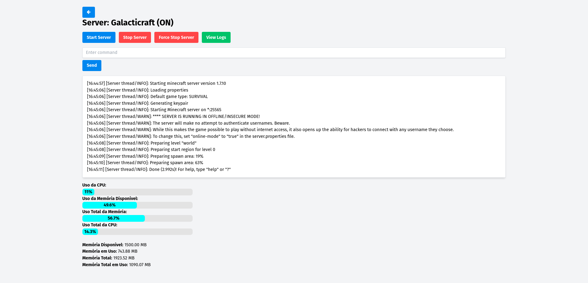

# mcmanager

## Instalação

  ```console
sudo apt-get install openjdk-8-jre-headless
  ```

  ```console
python3 -m pip install -r requirements.txt
python3 manage.py generate_secret_key
python3 manage.py migrate 
python3 manage.py createsuperuser     
  ```

## Exemplo


