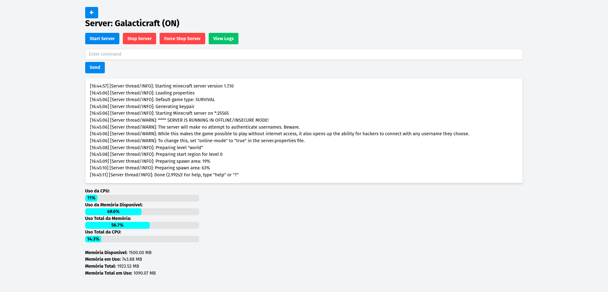

# mcmanager (BETA)

Um painel web simples baseado em Django para gerenciar servidores Minecraft diretamente na sua VPS Linux.

## Instalação

### 1. Instalar o Java 8 (Necessário para o Minecraft)

```console
sudo apt-get update
sudo apt-get install openjdk-8-jre-headless
```

### 2. Instalar o mcmanager do PyPI

```console
pip install mcmanager
```

### 3. Inicializar e rodar o painel

```console
# Inicializa o banco de dados e cria os diretórios na pasta ~/.mcmanager
mcmanager init

# Cria um usuário administrador
mcmanager createsuperuser

# Inicia o painel
mcmanager run
```

Pronto! Acesse `http://sua-vps-ip:8000/admin/` para logar com o superusuário criado e começar a gerenciar seus servidores.

---

## Estrutura de Diretórios e Dados

Por padrão, todos os dados do painel ficam armazenados de forma isolada na home do usuário:
- `~/.mcmanager/db.sqlite3` (Banco de dados do painel)
- `~/.mcmanager/jar/` (Coloque seus arquivos `.jar` de servidor aqui, ex: `spigot.jar`, `vanilla.jar`)
- `~/.mcmanager/servers/` (Diretório onde cada servidor criado será executado)
- `~/.mcmanager/configs/` (Onde fica o `server.properties` padrão)
- `~/.mcmanager/staticfiles/` (Arquivos estáticos compilados do painel)

### Diagnóstico: servidor liga e desliga sozinho (ou não fica "ON")

Se você der start num servidor e ele aparecer "ON" por um instante e voltar pra "OFF" (ou nunca chegar a ficar "ON"), o processo do Java/Minecraft morreu logo depois de iniciar. Causas comuns:

* Versão do Java incompatível com o `.jar` configurado (ex: jar exige Java 17+, mas `MCMANAGER_JAVA_BIN` aponta pra um Java 8).
* `eula.txt` não aceito (o mcmanager já cria esse arquivo automaticamente ao provisionar o servidor, mas confira se não foi apagado).
* Arquivo `.jar` corrompido ou incompatível com o sistema.
* Memória (`memory_limit`) configurada baixa/alta demais pro que a VPS suporta.
* Se "Reinício automático" estiver ativado pro servidor: o supervisor tenta religar sozinho até 3 vezes antes de desistir e desativar o reinício automático — o padrão "ON por 1s, OFF" repetido algumas vezes é esse ciclo de tentativas.

**Onde olhar:**
* **Log do próprio Minecraft**: `~/.mcmanager/servers/server_<id>/logs/latest.log`, visível ao vivo na página do console do servidor (`/console/<id>/`). Só existe se o Minecraft chegou a inicializar o próprio logger antes de morrer — em falhas muito cedo (ex: Java incompatível), esse arquivo pode não ter nada útil ou nem existir.
* **Log do supervisor** (reinício automático): tentativas de religar e a desativação após 3 falhas são registradas via `logging` do Python, mas **só aparecem no terminal onde `mcmanager run` está rodando** — não são salvos em nenhum arquivo, e se perdem ao fechar o terminal.
* **Limitação atual conhecida**: o mcmanager hoje descarta a saída (stdout/stderr) do processo Java diretamente — se o servidor morrer antes de escrever no próprio `logs/latest.log`, não sobra nenhum diagnóstico salvo em lugar nenhum, nem no painel nem em arquivo. Rodar `mcmanager doctor` ajuda a descartar causas comuns (Java ausente/errado, diretórios sem permissão, banco de dados desatualizado) antes de investigar mais a fundo.

### Customizações por Variáveis de Ambiente

Você pode ajustar o comportamento do painel definindo variáveis de ambiente antes de executar o comando `mcmanager`:

* **`MCMANAGER_DATA_DIR`**: Altera a pasta padrão onde os servidores e banco de dados são salvos (padrão: `~/.mcmanager`).
* **`MCMANAGER_JAVA_BIN`**: Especifica o caminho binário do Java (padrão: `/usr/lib/jvm/java-8-openjdk-amd64/bin/java`). Use `whereis java` para encontrar o caminho correto na sua VPS.
* **`MCMANAGER_ALLOWED_HOSTS`**: Lista de hosts permitidos separados por vírgula (padrão: `*`).
* **`MCMANAGER_DEBUG`**: Define se o painel roda em modo debug (`True` ou `False`).

Exemplo definindo um caminho diferente de Java e iniciando:
```console
export MCMANAGER_JAVA_BIN="/usr/bin/java"
mcmanager run
```

---

## Desenvolvimento Local

Se você deseja contribuir ou modificar o código localmente:

1. Clone o repositório.
2. Crie e ative um ambiente virtual.
3. Instale as dependências e o pacote local no modo editável:
   ```console
   pip install -r requirements.txt
   pip install -e .
   ```
4. Ao rodar `python manage.py runserver`, o painel rodará em modo debug local e usará a própria pasta do projeto para salvar os arquivos de desenvolvimento.

### Comandos de Desenvolvimento Úteis

* **Formatar código:**
  ```console
  python manage.py format_code
  ```
* **Gerar nova Secret Key de desenvolvimento:**
  ```console
  python manage.py generate_secret_key
  ```

## Capturas de Tela


