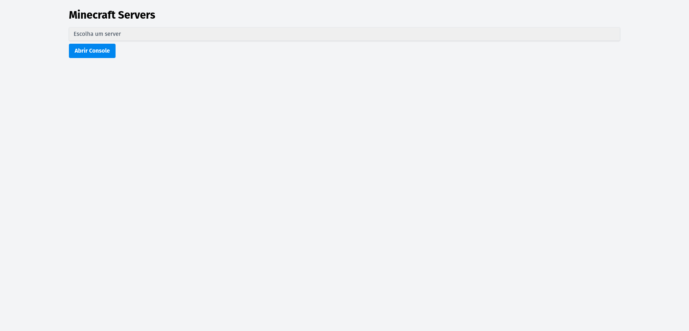

# mcmanager (BETA)

## Instalação

```console
sudo apt-get install openjdk-8-jre-headless
```

```console
python3 -m pip install -r requirements.txt
python3 manage.py generate_secret_key
python3 manage.py migrate 
python3 manage.py createsuperuser     
```

## Comandos Customizados

### Gerar chave secreta
  ```console
python3 manage.py generate_secret_key
  ```
### Formatar arquivos: .py, .html, .js, .css
```console
python3 manage.py format_code
```

## OBS:
### Lembre de checar "JAVA_BIN_PATH" na settings.py
```console
JAVA_BIN_PATH = "/usr/lib/jvm/java-8-openjdk-amd64/bin/java"
```
### Use o comando abaixo para localizar java-8-openjdk
```console
whereis java                                                                  
```
## Exemplo


